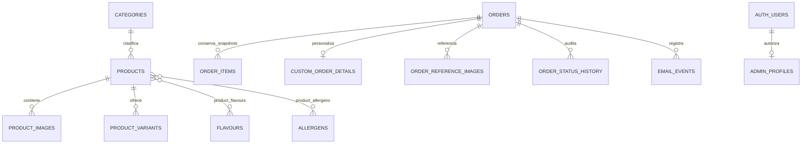

# Arquitectura — Fase 1

## Alcance

El frontend de Fase 0 continúa como interfaz provisional. Esta fase añade un backend Supabase local reproducible (PostgreSQL, Auth, RLS y Storage), sin catálogo visual, creación pública de pedidos, panel funcional ni servicios remotos.

## Flujo local y fuentes de verdad

`supabase/config.toml` configura servicios y bloquea signup. Las migraciones SQL versionadas son la única definición del esquema; `supabase db reset` las aplica desde cero, crea buckets y carga `supabase/seed.sql`. Studio solo sirve para inspección. Los tipos del cliente se regeneran con `npm run supabase:types`.

## Modelo de datos

Las entidades principales usan UUID, timestamps técnicos son `timestamptz`, fechas solicitadas son `date` y dinero son céntimos enteros. Los enums cierran modos de precio, tipo/estado de pedido, fulfilment y rol admin. Constraints validan precios, moneda, cantidades, raciones, rangos, slugs, referencias y singleton de settings. FKs destructivas sobre histórico usan `restrict` o `set null`; catálogo utiliza archivado/despublicación.

Un trigger reutilizable mantiene `updated_at`. Otro registra automáticamente el estado inicial y cada cambio de `orders.status`, usando `auth.uid()` cuando existe. Índices cubren navegación de catálogo y búsquedas habituales de pedidos/disponibilidad.

## Auth, autorización y RLS

Auth permanece habilitado para login, pero todo signup público está deshabilitado. `admin_profiles` separa autenticación de autorización. `is_admin()` comprueba el perfil activo y rol `admin`; usuarios autenticados normales e inactivos no adquieren permisos.

Todas las tablas públicas tienen RLS, complementada con grants mínimos. Anon solo lee settings, catálogo público y el resultado limitado de `get_public_availability()`. Esa función omite `reason_internal`; pedidos, clientes, notas, referencias, historial y email son privados. Admin activo administra el dominio, salvo que el historial y los eventos sean de solo lectura desde cliente.

## Storage

La migración crea `catalog-public` (público para lectura) y `order-references-private` (privado). Ambos restringen MIME y tamaño; las políticas de escritura/gestión exigen `is_admin()`. La Fase 1 no abre uploads públicos ni URLs permanentes privadas.

## Frontend

`src/lib/supabase.ts` solo consume URL y anon key públicas y utiliza `Database` desde `src/types/database.types.ts`. La service role nunca entra en el bundle. Las rutas y layouts continúan siendo placeholders de Fase 0; la UI funcional corresponde a fases posteriores.
